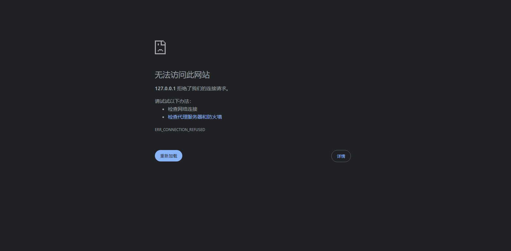

# Monitor Board（Docker 部署版）

这是一个轻量的多服务器监控看板项目，包含两个服务：

- `agent/`：部署在每台被监控机器上，提供 `/api/monitor/status`
- `dashboard/`：集中拉取多个 Agent 状态并展示在网页

本 README 已切换为 **Docker 部署优先** 的使用方式。

---

## 1. 项目结构

```text
monitor-board/
├─ agent/
│  ├─ server.js
│  ├─ package.json
│  ├─ Dockerfile
│  └─ .dockerignore
├─ dashboard/
│  ├─ server.js
│  ├─ package.json
│  ├─ Dockerfile
│  ├─ .dockerignore
│  ├─ config/
│  │  ├─ targets.example.json
│  │  ├─ alerts.example.json
│  │  ├─ notifications.example.json
│  │  └─ targets.docker.example.json
│  └─ public/
├─ docker-compose.yml
├─ .env.example
└─ README.md
```

---

## 2. 环境要求

- Docker Engine 24+
- Docker Compose v2（命令是 `docker compose`）

检查：

```bash
docker --version
docker compose version
```

---

## 3. 快速体验（单机，一条命令启动）

项目根目录已经提供了 `docker-compose.yml`。  
首次启动请先准备 `.env`（不要提交到仓库）：

```bash
cd monitor-board
cp .env.example .env
```

PowerShell 可用：

```powershell
Copy-Item .env.example .env
```

至少修改以下项：

- `AGENT_TOKEN`

然后启动：

```bash
docker compose up -d --build
```

启动后访问：

```text
http://127.0.0.1:9200/
```

说明：

- 演示模式会启动两个容器：
  - `monitor-agent-local`（9101）
  - `monitor-dashboard`（9200）
- Dashboard 默认读取：`dashboard/config/targets.docker.example.json`

停止：

```bash
docker compose down
```

查看日志：

```bash
docker compose logs -f
```

---

## 4. 生产部署（多台服务器）

推荐架构：

- 每台业务机器部署一个 Agent 容器
- 在一台监控机器部署 Dashboard 容器
- Dashboard 通过内网地址访问各 Agent

### 4.1 在每台被监控机器部署 Agent

在该机器放置 `agent/` 目录后执行：

```bash
cd agent
docker build -t monitor-agent:0.1 .
```

启动容器：

```bash
export AGENT_TOKEN='your_strong_agent_token'
docker run -d \
  --name monitor-agent \
  --restart unless-stopped \
  -p 9101:9101 \
  -e PORT=9101 \
  -e AGENT_TOKEN="$AGENT_TOKEN" \
  monitor-agent:0.1
```

检查：

```bash
curl -H "Authorization: Bearer $AGENT_TOKEN" http://127.0.0.1:9101/api/monitor/status
```

### 4.2 在监控机器部署 Dashboard

在该机器放置 `dashboard/` 目录后执行：

```bash
cd dashboard
docker build -t monitor-dashboard:0.1 .
```

先创建配置文件（示例）：

```json
[
  {
    "name": "app-01",
    "url": "http://10.0.0.11:9101",
    "token": "agent_token_for_app_01"
  },
  {
    "name": "app-02",
    "url": "http://10.0.0.12:9101",
    "token": "agent_token_for_app_02"
  }
]
```

保存为：`/opt/monitor-board/targets.json`

如需告警通知，再创建：`/opt/monitor-board/notifications.json`
（可从 `dashboard/config/notifications.example.json` 复制后修改）

启动容器：

```bash
docker run -d \
  --name monitor-dashboard \
  --restart unless-stopped \
  -p 9200:9200 \
  -e PORT=9200 \
  -e REQUEST_TIMEOUT_MS=8000 \
  -e ALERT_POLL_MS=15000 \
  -v /opt/monitor-board/targets.json:/app/config/targets.json:ro \
  -v /opt/monitor-board/notifications.json:/app/config/notifications.json:ro \
  monitor-dashboard:0.1
```

访问：

```text
http://<dashboard-ip>:9200/
```

---

## 5. 使用说明

### 5.1 页面上能看到什么

- 目标机器在线状态
- CPU / 内存 / 磁盘 / 网络
- 部分系统服务与 Docker 信息（取决于目标机器环境）
- 汇总卡片 + 趋势图（CPU、内存、磁盘、网络）

### 5.2 页面交互功能（新）

- 手动刷新：点击右上角 `立即刷新`
- 自动刷新开关：可关闭/开启自动拉取
- 刷新间隔：支持 `5s / 10s / 30s / 60s`
- 状态过滤：全部 / 在线 / 离线 / 告警
- 名称搜索：按服务器名称快速筛选
- 排序：按风险、CPU、内存、磁盘、名称排序
- 一键诊断：检测网络连通、鉴权、接口可用性、请求耗时
- 错误可视化：离线目标显示错误原因（例如超时、403、连接失败）
- 控件偏好自动记忆：刷新间隔、自动刷新、过滤、排序会保存在浏览器本地
- 单机详情面板：点击任意服务器行可查看该机器的详细信息（系统、磁盘、服务、Docker、TCP 状态）
- 单机详情新增“故障原因详情”：展示规则阈值、原始值、触发原因、最近 3 次状态变化
- 看板底部提供“打开配置入口”按钮，可进入 `/config.html`（小白模式：参数说明 + JSON 生成 + 测试发送）
- 告警 ACK 能力：支持通过 API 对目标执行 ACK / 解除 ACK，并记录责任人和备注

### 5.3 告警阈值配置（新）

Dashboard 支持从配置文件或环境变量读取阈值：

1. 文件方式（推荐）

- 复制 `dashboard/config/alerts.example.json` 为 `dashboard/config/alerts.json`
- 按需修改阈值

示例：

```json
{
  "cpu": { "warn": 75, "danger": 90 },
  "mem": { "warn": 80, "danger": 92 },
  "disk": { "warn": 70, "danger": 85 },
  "serviceFailedDanger": 1
}
```

2. 环境变量方式

```bash
MONITOR_ALERTS='{"cpu":{"warn":75,"danger":90},"mem":{"warn":80,"danger":92},"disk":{"warn":70,"danger":85},"serviceFailedDanger":1}'
```

优先级：`MONITOR_ALERTS` > `config/alerts.json` > 内置默认值。

### 5.4 告警通知绑定（企业微信/Telegram/钉钉）

Dashboard 支持多绑定、多目标、多渠道通知。  
配置文件：`dashboard/config/notifications.json`

快速开始：

1. 复制 `dashboard/config/notifications.example.json` 为 `dashboard/config/notifications.json`
2. 把各渠道账号信息填进去（Webhook/BotToken/ChatId）
3. 设置 `enabled: true`
4. 重启 Dashboard

配置页（`/config.html`）已提供：

- 小白可视化编辑（多绑定/多渠道）
- 模板变量速查
- 模板变量一键复制
- 模板预览沙箱（支持绑定模板/渠道模板切换 + 示例载荷，不会发送真实通知）
- 模板预览历史（本地保存最近 20 条）
- 模板片段导入/导出（绑定模板、渠道模板）
- 测试发送支持“全部渠道 / 当前渠道 / 指定渠道名”

绑定字段说明：

- `bindings[].targets`：匹配目标，可填 `*`（全部）或具体名称，也支持通配符如 `prod-*`
- `bindings[].severities`：订阅级别，可填 `warn` / `danger` / `offline` / `all`
- `bindings[].notifyRecover`：是否发送恢复通知
- `messageLocale` / `messageTemplates`：全局默认消息模板（支持 `alert/recover/escalate/test`）
- `bindings[].messageLocale` / `bindings[].messageTemplates`：绑定级模板覆盖
- `bindings[].channels`：通知账号列表
  - 企业微信：`type=wechat` + `webhook`
  - Telegram：`type=telegram` + `botToken` + `chatId`
  - 钉钉：`type=dingtalk` + `webhook` (+ `secret` 可选)
  - `channels[].messageLocale` / `channels[].messageTemplates`：渠道级模板覆盖（优先级最高）
- `bindings[].silences`：静默窗口（按绑定/目标）
  - `startAt`（可选）/`endAt`（必填）：ISO 时间
  - `targets`：目标匹配列表，支持 `*` 和通配符
  - `severities`：静默级别，支持 `warn` / `danger` / `offline` / `all`
- `bindings[].silenceUntil`：简化静默写法（等同于一条 `silences`，到指定时间前静默）

模板变量（配置页内有可视化速查）：  
`{{titlePrefix}} {{bindingName}} {{targetName}} {{targetUrl}} {{severity}} {{previousSeverity}} {{escalationLevel}} {{unackedSec}} {{reasons}} {{metrics}} {{timestamp}}`

触发逻辑：

- 首次进入告警会发送
- 严重级别升级会立即发送
- 原因变化按冷却时间发送
- 恢复正常可发送恢复通知

测试通知：

```bash
curl -X POST http://127.0.0.1:9200/api/alerts/test \
  -H "Content-Type: application/json" \
  -d '{"binding":"ops-all","message":"manual test","severity":"danger"}'
```

### 5.5 新增或修改被监控机器

Dashboard 读取 `targets.json`，格式如下：

```json
[
  {
    "name": "server-01",
    "url": "http://10.0.0.10:9101",
    "token": "your_agent_token",
    "env": "prod",
    "business": "pay",
    "room": "cn-hz-a",
    "owner": "alice"
  },
  {
    "name": "server-02",
    "url": "http://10.0.0.11:9101",
    "token": "your_agent_token",
    "tags": {
      "env": "staging",
      "business": "ops",
      "room": "cn-sh-b",
      "owner": "bob"
    }
  }
]
```

可选标签字段（用于看板筛选与统计）：`env`、`business`、`room`、`owner`。  
支持两种写法：顶层字段或 `tags` 对象，二者同时存在时优先取顶层字段。

修改后重启 Dashboard 容器：

```bash
docker restart monitor-dashboard
```

也可通过 Dashboard API 直接保存配置（会自动备份旧文件，见第 6 章）。

### 5.6 保存常用视图（Saved Views）

看板顶部已支持“保存视图”：把当前筛选条件保存为可复用视图，一键切换。

- 视图会保存这些条件：`状态`、`环境`、`业务`、`机房`、`负责人`、`排序`、`搜索词`
- 点击 `保存视图`：
  - 当前没有选中已保存视图时，会要求输入新名称
  - 当前选中某个已保存视图时，会直接更新该视图
- 点击 `删除视图`：删除当前选中的已保存视图
- 点击 `重置筛选`：恢复到默认筛选（`全部 + 按风险`）

说明：Saved Views 保存在浏览器 `localStorage`，属于当前浏览器本地数据。

### 5.7 风险热度与事件趋势

看板新增两块可视化：

- `风险热度榜 TOP5`：按风险分值自动排序，优先展示最需要处理的目标
- `事件趋势`：按时间区间展示 `Warn / Danger / Offline` 数量变化

配合顶部 `图表区间` 可快速查看分钟/小时/天级别趋势。

### 5.8 单机详情卡片化与折叠

单机详情区域已按模块拆分，并支持折叠展开：

- 模块分区：`故障原因`、`服务状态`、`故障定位`、`目标标签`、`系统信息`、`磁盘分区`、`Docker`、`TCP`
- 支持单块 `展开/收起`
- 支持顶部 `展开全部 / 收起全部`

说明：折叠状态保存在浏览器 `localStorage`，刷新页面后会保留。

### 5.9 Prometheus 历史趋势（7/30 天）

启用 `PROMETHEUS_HISTORY_ENABLED=true` 后：

- 看板会在切换图表区间时自动从 Prometheus 拉取历史数据
- 支持更长时间窗口（例如 7 天 / 30 天）
- 若 Prometheus 不可用，会自动回退到当前进程内实时趋势，不影响看板基本使用

---

## 6. API 说明

统一约定：

- 旧路径继续可用：`/api/...`
- 新版本别名：`/api/v1/...`
- 所有 API 响应会带 `X-API-Version` 响应头（`legacy` 或 `v1`）

### Agent

- `GET /healthz`：健康检查
- `GET /readyz`：就绪检查（会尝试读取一次监控状态缓存）
- `GET /api/monitor/status`：监控数据

若设置了 `AGENT_TOKEN`，请求必须带：

```text
Authorization: Bearer <AGENT_TOKEN>
```

### Dashboard

- `GET /healthz`：健康检查
- `GET /readyz`：就绪检查（静态目录/配置目录/配置加载状态；配置校验失败时返回 `503`）
- `GET /api/targets`：读取已配置目标（不返回 token，包含 `metadata/tags` 标签）
- `GET /api/targets/status`：聚合拉取所有目标状态（共享采集缓存，支持 `?refresh=1` 强制刷新 + 分页）
- `GET /api/history/summary`：从 Prometheus 查询历史趋势（`range`/`step`/`targets`）
- `POST /api/targets/diagnose`：一键诊断目标连通性/鉴权/API/耗时
- `GET /api/settings`：读取看板设置（告警阈值、可选刷新间隔、配置校验状态、备份策略、目标标签选项）
- `GET /api/auth/me`：返回当前访问角色（RBAC 启用时）
- `GET /api/audit/logs`：查询审计日志（支持 `page`/`pageSize`/`offset`/`action`，管理员）
- `GET /api/audit/export`：导出审计日志 JSONL（管理员）
- `PUT /api/config/:type`：保存配置（`type=targets|alerts|notifications`，自动备份）
- `GET /api/config/backups?type=...`：查看某类配置的备份列表（支持分页）
- `POST /api/config/rollback`：从备份回滚配置
- `GET /api/targets/export`：批量导出目标配置（管理员，支持分页）
- `POST /api/targets/import`：批量导入目标配置（支持 `replace` / `merge`）
- `PATCH /api/targets/bulk/metadata`：批量更新目标标签（env/business/room/owner）
- `PATCH /api/alerts/bulk-thresholds`：批量更新阈值（部分字段补丁）
- `PATCH /api/notifications/bulk/targets`：批量更新通知绑定的目标范围
- `GET /api/alerts/state`：读取最近告警状态缓存
- `GET /api/alerts/acks`：读取已确认（ACK）的目标列表
- `POST /api/alerts/acks`：确认 ACK（支持 `owner`、`note`）
- `POST /api/alerts/unack`：取消 ACK
- `DELETE /api/alerts/acks?targetUrl=...`：取消 ACK（REST 方式）
- `POST /api/alerts/test`：发送测试通知到已绑定渠道

分页约定（列表接口）：

- 参数：`page`（从 1 开始）、`pageSize`（受 `API_PAGINATION_MAX` 限制）、`offset`
- 返回：`pagination={page,pageSize,offset,total,totalPages}`

标准错误结构：

```json
{
  "message": "target not found",
  "error": {
    "code": "TARGET_NOT_FOUND",
    "message": "target not found",
    "details": {}
  }
}
```

配置接口示例：

```bash
# 保存 alerts（自动备份旧文件）
curl -X PUT http://127.0.0.1:9200/api/config/alerts \
  -H "Content-Type: application/json" \
  -d '{"cpu":{"warn":80,"danger":95},"mem":{"warn":80,"danger":95},"disk":{"warn":80,"danger":95},"serviceFailedDanger":1}'

# 查看 alerts 备份
curl "http://127.0.0.1:9200/api/config/backups?type=alerts"

# 从备份回滚
curl -X POST http://127.0.0.1:9200/api/config/rollback \
  -H "Content-Type: application/json" \
  -d '{"type":"alerts","backupFile":"alerts-20260310-104000Z.json"}'

# 查询最近 100 条审计日志
curl "http://127.0.0.1:9200/api/v1/audit/logs?page=1&pageSize=100" \
  -H "Authorization: Bearer <admin_token>"

# 查询历史趋势（Prometheus）
curl "http://127.0.0.1:9200/api/history/summary?range=7d&step=30m"

# 批量导入 targets（replace）
curl -X POST http://127.0.0.1:9200/api/targets/import \
  -H "Authorization: Bearer <admin_token>" \
  -H "Content-Type: application/json" \
  -d '{"mode":"replace","targets":[{"name":"node-a","url":"http://10.0.0.1:9101","env":"prod","owner":"alice"}]}'

# 批量更新目标标签（按名称匹配）
curl -X PATCH http://127.0.0.1:9200/api/targets/bulk/metadata \
  -H "Authorization: Bearer <admin_token>" \
  -H "Content-Type: application/json" \
  -d '{"targetNames":["node-a","node-b"],"patch":{"business":"pay","room":"cn-hz-a"}}'
```

说明：若设置了 `MONITOR_TARGETS` / `MONITOR_ALERTS` / `MONITOR_NOTIFICATIONS`，文件写入类接口会返回 `409`（避免被环境变量覆盖后产生误解）。

若启用 RBAC，API 需要带 token：

```bash
curl http://127.0.0.1:9200/api/settings \
  -H "Authorization: Bearer <your_token>"
```

### Notify Bridge

- `GET /healthz`：健康检查
- `GET /readyz`：就绪检查（通知配置来源与可用性）
- `POST /api/alerts/webhook`：接收 Alertmanager Webhook
- `POST /api/alerts/test`：发送测试通知

---

## 7. 环境变量

推荐做法：复制 `.env.example` 为 `.env`，在根目录用 `docker compose` 启动时自动加载。

### Agent

- `PORT`：默认 `9101`
- `AGENT_TOKEN`：默认空（生产必须设置）
- `CMD_TIMEOUT_MS`：默认 `1500`
- `STATUS_CACHE_TTL_MS`：状态缓存毫秒，默认 `2000`
- `METRICS_TOKEN`：`/metrics` 的 Bearer Token（可选）
- `EXIT_ON_UNCAUGHT_EXCEPTION`：默认 `false`，设为 `true` 时遇到未捕获异常自动退出进程

### Dashboard

- `PORT`：默认 `9200`
- `REQUEST_TIMEOUT_MS`：默认 `8000`
- `MONITOR_TARGETS`：可用 JSON 字符串直接覆盖目标配置
- `MONITOR_ALERTS`：可用 JSON 字符串覆盖告警阈值配置
- `MONITOR_NOTIFICATIONS`：可用 JSON 字符串覆盖通知绑定配置
- `ALERT_POLL_MS`：告警轮询间隔毫秒，默认 `15000`
- `ALERT_LOOP_ENABLED`：是否启用告警轮询，默认 `true`
- `COLLECTION_CACHE_TTL_MS`：目标状态共享缓存毫秒数，默认 `min(ALERT_POLL_MS, 5000)`，用于 UI 与告警循环复用采集结果
- `PROMETHEUS_HISTORY_ENABLED`：是否启用 Prometheus 历史查询，默认 `false`
- `PROMETHEUS_BASE_URL`：Prometheus 地址，默认 `http://prometheus:9090`
- `PROMETHEUS_QUERY_TIMEOUT_MS`：Prometheus 查询超时毫秒，默认 `10000`
- `PROMETHEUS_TARGET_LABEL`：Prometheus 中用于目标过滤的标签名，默认 `target`
- `API_PAGINATION_MAX`：API 分页最大 `pageSize`，默认 `500`
- `ALERT_DEBOUNCE_FAIL_COUNT`：连续异常次数达到该值后触发告警，默认 `1`
- `ALERT_DEBOUNCE_RECOVER_COUNT`：连续恢复正常次数达到该值后发送恢复通知，默认 `1`
- `STATE_PERSIST_ENABLED`：是否启用告警状态持久化，默认 `true`
- `STATE_DB_FILE`：SQLite 状态库路径，默认 `/app/data/dashboard-state.db`（容器内）
- `NOTIFY_RETRY_COUNT`：通知失败重试次数，默认 `2`
- `NOTIFY_RETRY_BACKOFF_MS`：通知重试退避基准毫秒，默认 `1000`（指数退避）
- `DEADLETTER_FILE`：通知死信日志文件，默认 `/app/logs/dashboard-deadletter.jsonl`（容器内）
- `CONFIG_BACKUP_DIR`：配置备份目录，默认 `/app/config/backups`（容器内）
- `CONFIG_BACKUP_MAX`：每类配置最多保留备份数，默认 `20`
- `RBAC_ENABLED`：是否启用角色鉴权，默认 `false`
- `RBAC_TOKENS`：JSON 形式角色 token，如 `{\"readonly\":\"...\",\"operator\":\"...\",\"admin\":\"...\"}`
- `RBAC_TOKEN_READONLY`：只读 token（可与 `RBAC_TOKENS` 混用，后者会被此变量覆盖）
- `RBAC_TOKEN_OPERATOR`：操作员 token（可执行诊断、ACK、测试通知）
- `RBAC_TOKEN_ADMIN`：管理员 token（可写配置、回滚）
- `AUDIT_LOG_FILE`：审计日志文件路径，默认 `/app/logs/dashboard-audit.jsonl`
- `AUDIT_MAX_READ`：单次查询审计日志最大条数，默认 `1000`
- `EXIT_ON_UNCAUGHT_EXCEPTION`：默认 `false`，设为 `true` 时遇到未捕获异常自动退出进程

### Notify Bridge

- `PORT`：默认 `9300`
- `REQUEST_TIMEOUT_MS`：默认 `8000`
- `NOTIFICATIONS_FILE`：通知配置文件路径，默认 `/app/config/notifications.json`
- `STATE_TTL_MS`：告警状态保留时间，默认 `7d`
- `MONITOR_NOTIFICATIONS`：可用 JSON 字符串直接覆盖通知配置
- `STATE_PERSIST_ENABLED`：是否启用告警状态持久化，默认 `true`
- `STATE_DB_FILE`：SQLite 状态库路径，默认 `/app/data/notify-bridge-state.db`（容器内）
- `NOTIFY_RETRY_COUNT`：通知失败重试次数，默认 `2`
- `NOTIFY_RETRY_BACKOFF_MS`：通知重试退避基准毫秒，默认 `1000`（指数退避）
- `DEADLETTER_FILE`：通知死信日志文件，默认 `/app/logs/notify-bridge-deadletter.jsonl`（容器内）
- `EXIT_ON_UNCAUGHT_EXCEPTION`：默认 `false`，设为 `true` 时遇到未捕获异常自动退出进程

### Docker Compose（根目录）

- `AGENT_TOKEN`：必填，`docker-compose.yml` 和 `docker-compose.monitoring.yml` 都会使用
- `METRICS_TOKEN`：可选，用于保护 Agent 的 `/metrics`
- `API_PAGINATION_MAX`：Dashboard API 最大分页大小，默认 `500`
- `GRAFANA_ADMIN_USER`：Grafana 管理员用户名（监控栈）
- `GRAFANA_ADMIN_PASSWORD`：Grafana 管理员密码（监控栈，建议强密码）
- `RBAC_ENABLED`：是否启用 Dashboard RBAC，默认 `false`
- `RBAC_TOKEN_READONLY` / `RBAC_TOKEN_OPERATOR` / `RBAC_TOKEN_ADMIN`：RBAC token

---

## 8. 常用运维命令（Docker）

查看运行状态：

```bash
docker ps
```

查看日志：

```bash
docker logs -f monitor-agent
docker logs -f monitor-dashboard
```

重启：

```bash
docker restart monitor-agent
docker restart monitor-dashboard
```

更新（重新构建并重启）：

```bash
cd monitor-board
docker compose up -d --build
```

一键运维诊断（服务健康 / 配置 / 连通性）：

```bash
npm run ops:doctor
```

严格模式（发现 FAIL 返回非 0）：

```bash
npm run ops:doctor:strict
```

Windows PowerShell 也可直接运行：

```powershell
.\scripts\ops-doctor.ps1
```

容量压测（100/300/500 目标）：

```bash
npm run ops:capacity
```

---

## 9. 安全建议

- 所有 token / 密码统一放到 `.env`（基于 `.env.example`），不要写死在脚本和 compose 文件中
- 为每台 Agent 设置强随机 `AGENT_TOKEN`
- 为 Grafana 设置强随机 `GRAFANA_ADMIN_PASSWORD`
- 仅允许 Dashboard 所在机器访问 Agent 的 `9101` 端口
- Dashboard 建议放内网，或放到 Nginx 后并启用 HTTPS + 认证
- 不要把带 token 的 `targets.json` 暴露在公开仓库

---

## 10. 注意事项

- 本项目最适合 Linux 目标机。
- Agent 以容器方式运行时，部分“主机级”指标可能受容器隔离影响（如 `systemctl`、部分磁盘/进程视图）。
- 若你希望最完整的主机指标，可将 Agent 直接运行在主机系统上（非容器）或按你的环境做更深的容器权限配置。

---

## 11. Prometheus + Grafana 迁移（第一阶段）

已新增一套并行迁移骨架，包含：

- Prometheus（采集 + 规则）
- Alertmanager（告警路由）
- Grafana（可视化，已预置现代化仪表盘）
- notify-bridge（复用 `notifications.json`，继续发送企业微信/Telegram/钉钉）
- 现有 dashboard 继续保留（配置入口 / 小白页面），并可关闭内置告警循环避免重复通知

### 11.1 新增文件

```text
docker-compose.monitoring.yml
monitoring/
├─ prometheus/
│  ├─ prometheus.yml
│  ├─ alert.rules.yml
│  └─ targets/
│     ├─ agents.example.yml
│     └─ README.md
├─ alertmanager/
│  └─ alertmanager.yml
└─ grafana/
   ├─ provisioning/
   │  ├─ datasources/prometheus.yml
   │  └─ dashboards/dashboards.yml
   └─ dashboards/monitor-board-overview.json
notify-bridge/
├─ server.js
├─ package.json
├─ Dockerfile
└─ .dockerignore
```

### 11.2 Agent 新增 `/metrics`

Agent 现在支持：

- `GET /api/monitor/status`（原有 JSON 接口）
- `GET /metrics`（Prometheus 格式）

新增环境变量：

- `STATUS_CACHE_TTL_MS`：状态缓存毫秒，默认 `2000`
- `METRICS_TOKEN`：`/metrics` 的 Bearer Token（可选）

### 11.3 一键启动迁移栈

先准备 `.env`：

```bash
cp .env.example .env
```

PowerShell 可用：

```powershell
Copy-Item .env.example .env
```

至少填写：

- `AGENT_TOKEN`
- `GRAFANA_ADMIN_PASSWORD`

再启动：

```bash
cd monitor-board
docker compose -f docker-compose.monitoring.yml up -d --build
```

访问入口：

- 旧看板与配置页：`http://127.0.0.1:9200/`
- Prometheus：`http://127.0.0.1:9090/`
- Alertmanager：`http://127.0.0.1:9093/`
- Grafana：`http://127.0.0.1:3000/`（账号密码来自 `.env` 的 `GRAFANA_ADMIN_USER` / `GRAFANA_ADMIN_PASSWORD`）
- 通知桥接健康检查：`http://127.0.0.1:9300/healthz`

### 11.4 通知配置保持兼容

`notify-bridge` 直接读取同一份通知文件，配置语义不变：

- 文件：`dashboard/config/notifications.json`
- 兼容字段：`enabled`、`cooldownSec`、`remindIntervalSec`、`bindings[].targets`、`bindings[].severities`、`bindings[].notifyRecover`、`bindings[].channels`、`bindings[].silences`、`bindings[].silenceUntil`

说明：

- 当前 `docker-compose.monitoring.yml` 默认挂载的是 `dashboard/config/notifications.example.json`。
- 生产请改成你的真实配置文件（建议复制为 `dashboard/config/notifications.json` 再挂载）。

### 11.5 阈值调整位置

当前 Prometheus 告警阈值在：

- `monitoring/prometheus/alert.rules.yml`

并包含两类规则：

- Recording rules（供仪表盘和聚合查询复用）
- Alert rules（warn/danger/offline）

默认与原项目接近：

- CPU：`85/95`
- 内存：`85/95`
- 磁盘：`80/90`
- 服务故障：`>=1`

### 11.6 验证步骤

1. 检查 Agent 指标是否可抓取：

```bash
curl http://127.0.0.1:9101/metrics
```

2. 在 Prometheus 执行查询：

- `up{job="monitor-agent"}`
- `monitor_cpu_usage_percent`
- `monitor_service_failed_total`

3. 在 Grafana 打开预置看板：

- `Monitor Board / Monitor Board Next`

4. 测试 notify-bridge：

```bash
curl -X POST http://127.0.0.1:9300/api/alerts/test \
  -H "Content-Type: application/json" \
  -d '{"severity":"danger","target":"manual-test","message":"bridge test"}'
```

5. 执行双栈可用性验证：

```bash
npm run ops:verify-dual-stack
```

### 11.7 监控标准与免改码扩容

已支持通过 Prometheus `file_sd` 动态管理目标，不需要改代码：

1. 在 `monitoring/prometheus/targets/*.yml` 增加新目标
2. 补全标准标签：`target/env/business/room/owner`
3. 触发 Prometheus reload：`POST /-/reload`

详细规范见：

- `docs/MONITORING_STANDARDS.md`
- `docs/GRAFANA_MIGRATION_RUNBOOK.md`

---

## 12. 程序页面截图



---

## 13. 测试

根目录已提供统一测试命令（基于 Node.js 内置 test runner）：

```bash
npm test
```

覆盖率检查（当前对核心分页模块启用阈值门禁）：

```bash
npm run test:coverage
```

UI 回归 E2E（Playwright）：

```bash
npm run test:e2e
```

一次性执行 API/单元 + E2E：

```bash
npm run test:all
```

当前测试范围：

- 单元测试：`dashboard/lib/api-utils.js`
- 集成测试：
  - `tests/integration/agent.api.test.js`
  - `tests/integration/dashboard.api.test.js`
  - `tests/integration/notify-bridge.api.test.js`
- UI E2E 回归：
  - `tests/e2e/dashboard-regression.spec.js`
  - 覆盖场景：看板筛选（状态/环境/搜索）+ 配置页生成 + 测试发送

---

## 14. CI/CD

已内置 GitHub Actions：

- `.github/workflows/ci.yml`
  - 每次 `push/pull_request` 自动执行：
    - `npm run lint`
    - `npm test`
    - `npm run test:coverage`
    - `npm run test:e2e`
    - Docker 镜像构建 + Trivy 漏洞扫描（`HIGH/CRITICAL` 卡口）
- `.github/workflows/staged-deploy.yml`
  - 手工触发分阶段部署（`staging` / `production`）
  - 使用 SSH 到目标机器执行 `docker compose pull && up -d`

详细说明见：`docs/CI_CD.md`

运维排障工具说明见：`docs/OPS_TOOLKIT.md`

---

## 15. 运维文档

- 运维手册：`docs/OPS_RUNBOOK.md`
- 告警手册：`docs/ALERT_RUNBOOK.md`
- 事故响应 SOP：`docs/INCIDENT_SOP.md`
- 值班交接手册：`docs/ONCALL_HANDOVER.md`
- Grafana 迁移手册：`docs/GRAFANA_MIGRATION_RUNBOOK.md`
- 容量压测指南：`docs/CAPACITY_GUIDE.md`
- 当前容量报告：`docs/CAPACITY_REPORT.md`
